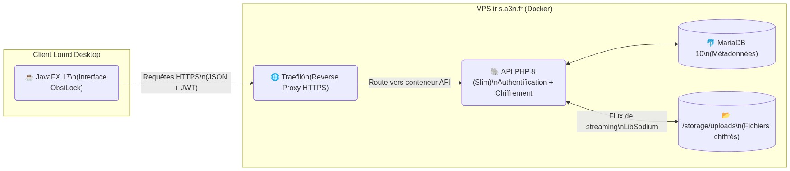
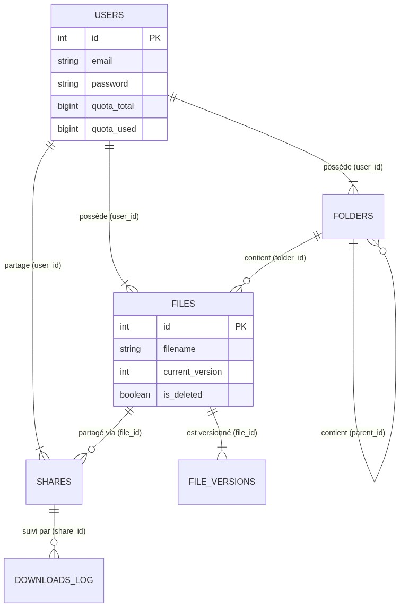
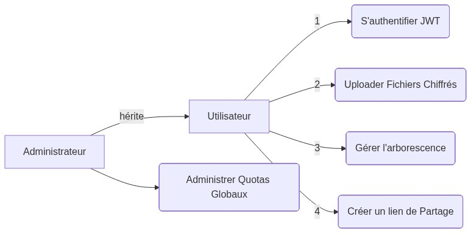
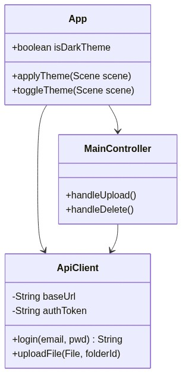

# 1. CAHIER DES CHARGES — ObsiLock


*ObsiLock — BTS SIO — 2026*  
*Page 1/15*

---

## 📋 1. Contexte & Problématique
**Nom du projet :** ObsiLock — Coffre-Fort Numérique  
**Contexte :** Projet de validation BTS SIO (Option SLAM)
**Problématique métier :** Dans un contexte d'augmentation du vol de données sur le cloud public, les utilisateurs ont besoin de stocker leurs fichiers sans jamais avoir de fichier "en clair" sur le serveur de stockage. ObsiLock répond à cette faille par une approche de **chiffrement au repos**.

---

## 🏗️ 2. Architecture Globale

Le projet repose sur une architecture **Client/Serveur découplée et stateless**.



---

## ✅ 3. Besoins Fonctionnels

1. **Authentification** : Système de création de compte et de connexion sécurisée (bcrypt) basée sur des JSON Web Tokens (JWT).
2. **Gestion des Fichiers/Dossiers** : Upload, téléchargement, création d'arborescence, renommage, "Soft Delete" (Corbeille). Upload en flux via chiffrement asymétrique (streaming 8Ko).
3. **Versioning Immutable** : Chaque version modifiée d'un fichier crée une nouvelle entrée en base (historique complet des altérations des fichiers).
4. **Partages Sécurisés** : Possibilité de créer des liens de téléchargements basés sur un token opaque (sans compte pour le destinataire), soumis à expiration ou limite de clics.
5. **Gestion des Quotas** : Quota maximum défini (ex: 50Mo par défaut). L'interface doit avertir l'utilisateur (barre de progression tricolore).
6. **Thème UI** : "Toggle Switch" pur CSS changeant le thème de l'application entière en un clic (Obsidian sombre ↔ Emerald vert clair).

---

## 🗄️ 4. MCD (Modèle Conceptuel des Données)



---

## 📊 5. MLD (Modèle Logique des Données)

*   **users** (<u>id</u>, email, password, quota_total, quota_used, created_at)
*   **folders** (<u>id</u>, #user_id, #parent_id, name, is_deleted, created_at)
*   **files** (<u>id</u>, #user_id, #folder_id, filename, stored_name, size, mime_type, current_version, is_deleted, uploaded_at)
*   **file_versions** (<u>id</u>, #file_id, version, stored_name, size, checksum, mime_type, iv, auth_tag, key_envelope, created_at)
*   **shares** (<u>id</u>, #user_id, #file_id, token, label, expires_at, max_uses, remaining_uses, is_revoked, created_at)
*   **downloads_log** (<u>id</u>, #share_id, ip, user_agent, success, message, downloaded_at)
*   **settings** (<u>id</u>, name, value)

---

## 🐧 6. MPD (Script SQL MariaDB/MySQL)

```sql
USE coffre_fort;

CREATE TABLE users (id INT AUTO_INCREMENT PRIMARY KEY, email VARCHAR(255) UNIQUE NOT NULL, password VARCHAR(255) NOT NULL, quota_total BIGINT DEFAULT 52428800, quota_used BIGINT DEFAULT 0, created_at DATETIME DEFAULT CURRENT_TIMESTAMP, INDEX idx_email (email)) ENGINE=InnoDB;

CREATE TABLE folders (id INT AUTO_INCREMENT PRIMARY KEY, user_id INT NOT NULL, parent_id INT NULL, name VARCHAR(255) NOT NULL, is_deleted TINYINT(1) DEFAULT 0, created_at DATETIME DEFAULT CURRENT_TIMESTAMP, FOREIGN KEY (user_id) REFERENCES users(id) ON DELETE CASCADE, FOREIGN KEY (parent_id) REFERENCES folders(id) ON DELETE SET NULL) ENGINE=InnoDB;

CREATE TABLE files (id INT AUTO_INCREMENT PRIMARY KEY, user_id INT NOT NULL, folder_id INT NULL, filename VARCHAR(255) NOT NULL, stored_name VARCHAR(255) NOT NULL, size BIGINT NOT NULL, mime_type VARCHAR(100) NOT NULL, current_version INT DEFAULT 1, is_deleted TINYINT(1) DEFAULT 0, uploaded_at DATETIME DEFAULT CURRENT_TIMESTAMP, FOREIGN KEY (user_id) REFERENCES users(id) ON DELETE CASCADE, FOREIGN KEY (folder_id) REFERENCES folders(id) ON DELETE SET NULL) ENGINE=InnoDB;

CREATE TABLE file_versions (id INT AUTO_INCREMENT PRIMARY KEY, file_id INT NOT NULL, version INT NOT NULL DEFAULT 1, stored_name VARCHAR(255) NOT NULL, size BIGINT NOT NULL, checksum VARCHAR(64), mime_type VARCHAR(100), iv TEXT, auth_tag TEXT, key_envelope TEXT, created_at DATETIME DEFAULT CURRENT_TIMESTAMP, FOREIGN KEY (file_id) REFERENCES files(id) ON DELETE CASCADE, UNIQUE KEY unique_version (file_id, version)) ENGINE=InnoDB;

CREATE TABLE shares (id INT AUTO_INCREMENT PRIMARY KEY, user_id INT NOT NULL, file_id INT NOT NULL, token VARCHAR(255) UNIQUE NOT NULL, label VARCHAR(255), expires_at DATETIME NULL, max_uses INT NULL, remaining_uses INT NULL, is_revoked TINYINT(1) DEFAULT 0, created_at DATETIME DEFAULT CURRENT_TIMESTAMP, FOREIGN KEY (user_id) REFERENCES users(id) ON DELETE CASCADE, FOREIGN KEY (file_id) REFERENCES files(id) ON DELETE CASCADE) ENGINE=InnoDB;

CREATE TABLE downloads_log (id INT AUTO_INCREMENT PRIMARY KEY, share_id INT NOT NULL, ip VARCHAR(45), user_agent TEXT, success TINYINT(1) DEFAULT 1, message TEXT, downloaded_at DATETIME DEFAULT CURRENT_TIMESTAMP, FOREIGN KEY (share_id) REFERENCES shares(id) ON DELETE CASCADE) ENGINE=InnoDB;

CREATE TABLE settings (id INT AUTO_INCREMENT PRIMARY KEY, name VARCHAR(50) UNIQUE NOT NULL, value VARCHAR(255) NOT NULL) ENGINE=InnoDB;
INSERT INTO settings (name, value) VALUES ('quota_bytes', '52428800');
```

---

## 👤 7. UML — Cas d'Utilisation

```mermaid
usecaseDiagram
    actor "Utilisateur" as user
    actor "Administrateur" as admin
    admin -l-|> user
    
    usecase "S'inscrire / S'authentifier (JWT)" as Auth
    usecase "Uploader fichier (Chiffré LibSodium)" as Upload
    usecase "Gérer les Partages (Lien Token)" as Share
    usecase "Consulter/Gérer Corbeille" as Trash
    usecase "Mettre à jour quotas" as Quota
    
    user --> Auth
    user --> Upload
    user --> Share
    user --> Trash
    admin --> Quota
```

*(Note : le mermaid `usecaseDiagram` n'existe pas officiellement sous ce nom, mais voici une modélisation C4/flowchart pour le UseCase :)*



---

## 💻 8. UML — Diagramme de Classes

**Frontend JavaFX :**


---

## 📅 9. Planning GANTT

```mermaid
gantt
    title Déroulement du Projet E5 : ObsiLock
    dateFormat  YYYY-MM-DD
    section Cadrage
    OpenAPI & Setup Git     :done,    des1, 2026-02-10, 1d
    section Développement Backend
    Auth JWT & DB Medoo     :done,    des2, 2026-02-11, 1d
    LibSodium Upload        :done,    des3, 2026-02-11, 1d
    Liens Partage & Logs    :done,    des4, 2026-02-12, 1d
    Versioning Fichiers     :done,    des5, 2026-02-13, 1d
    Sécurité (Rate Limiting):done,    des6, 2026-02-14, 1d
    section Front & Déploiement
    Tests Unitaires         :done,    des7, 2026-02-15, 1d
    GANTT, Docker Prod      :done,    des8, 2026-03-22, 1d
```

---

## ⚖️ 10. Contraintes Non-Fonctionnelles

| Critère | Exigence technique |
| :--- | :--- |
| **Sécurité** | Aucun fichier stocké en clair sur le serveur (`XSalsa20-Poly1305`). BDD chiffrée. Hash Bcrypt pour MDP. |
| **Performance** | Chiffrement en streaming par blocs de 8 Ko (pour ne pas crasher la RAM avec un fichier de 5 Go). |
| **Disponibilité** | Appuyé sur l'infrastructure Docker couplé au Proxy Traefik et Let's Encrypt (HTTPS auto). |
| **Ergonomie** | Thème JavaFX dynamique (Dark / Light) en pur CSS sans recompilation. |
