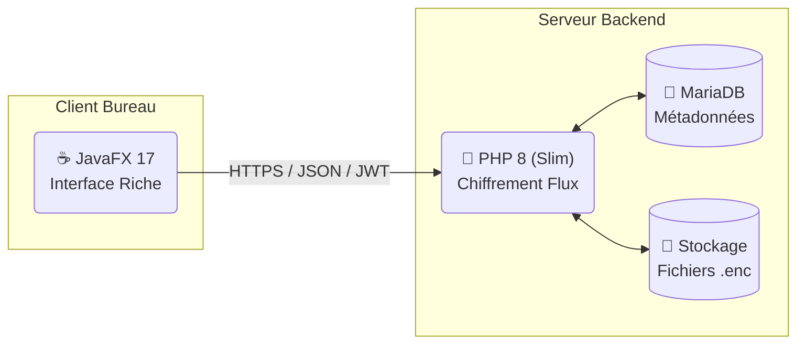
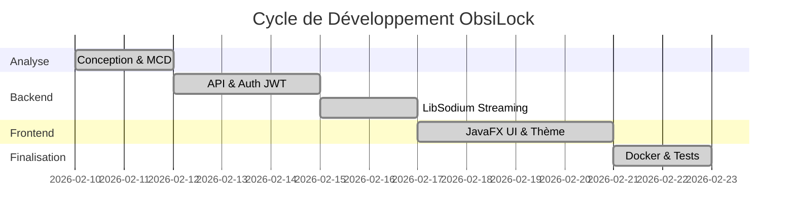

# 🛡️ 01. CAHIER DES CHARGES - ObsiLock

## 1. Contexte et Problématique
**ObsiLock** est un coffre-fort numérique sécurisé. 
*   **Problème :** Les solutions cloud (Drive, Dropbox) possèdent les clés de chiffrement et peuvent lire vos fichiers.
*   **Solution :** ObsiLock utilise le "chiffrement au repos". Aucun fichier n'est stocké en clair sur le serveur.

## 2. Architecture Globale
Le projet repose sur une architecture **Client/Serveur découplée et Stateless**.

## 3. Analyse des Besoins
### Besoins Fonctionnels :
- **Authentification :** JWT (Json Web Tokens).
- **Gestion Fichiers :** Upload, Téléchargement, Dossiers, Arborescence.
- **Sécurité :** Soft Delete (Corbeille) et Versioning (Historique).
- **Partage :** Liens publics avec limite d'utilisation.
- **Thème :** Switch Dark/Light en pur CSS.

### Besoins Non-Fonctionnels :
- **Sécurité :** Algorithme LibSodium (XSalsa20-Poly1305).
- **Performance :** Streaming par blocs de 8 Ko (pas de saturation RAM).
- **Portabilité :** Environnement Dockerisé.

## 4. Planning de Réalisation

