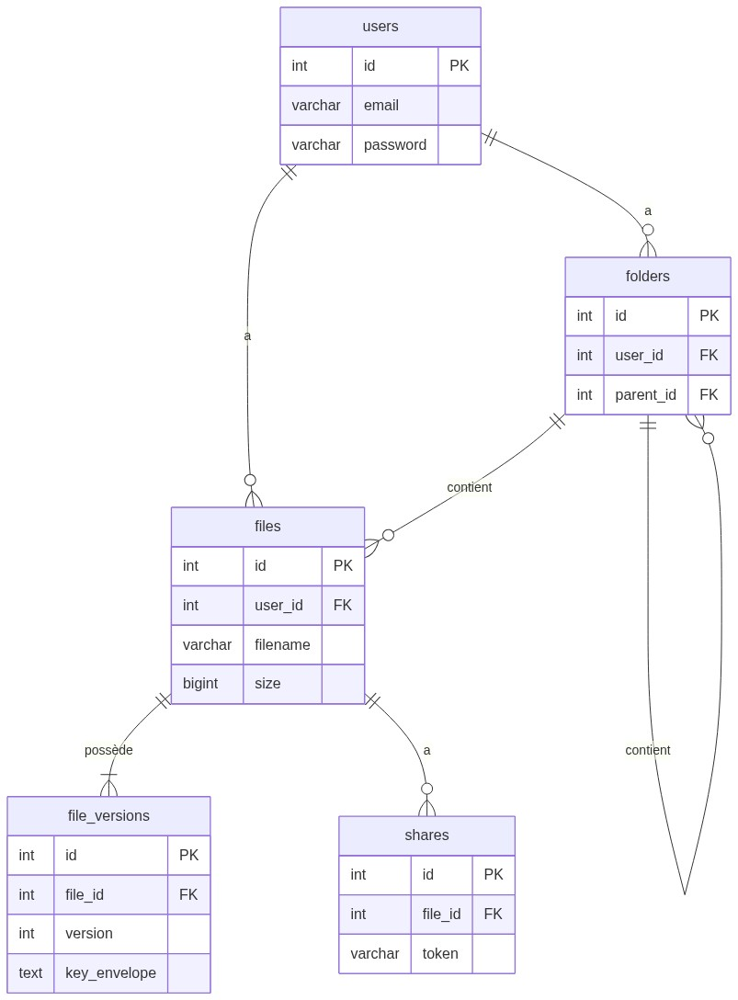

# 2. DOCUMENTATION BDD — ObsiLock

*ObsiLock — BTS SIO — 2026*  

---

## 🗄️ 1. Introduction au Schéma BDD

La base de données principale `coffre_fort` gère conjointement les utilisateurs, la hiérarchie des dossiers, les métadonnées des fichiers chiffrés et la journalisation des accès de partage public.

---

## 2. Description Détaillée des Tables

### 👤 2.1 Table `users`
**Rôle :** Identifie chaque utilisateur, stocke son mot de passe haché et surveille son quota de stockage global.
| Colonne | Type | Contrainte | Description |
| :--- | :--- | :--- | :--- |
| `id` | INT | PK, AI | Identifiant de l'utilisateur |
| `email` | VARCHAR(255) | UNIQUE, NOT NULL | Email servant d'identifiant de connexion |
| `password` | VARCHAR(255) | NOT NULL | Mot de passe sécurisé haché en **Bcrypt** |
| `quota_total` | BIGINT | DEFAULT 52428800 | Limite de stockage en octets (défaut = 50Mo) |
| `quota_used` | BIGINT | DEFAULT 0 | Consommation actuelle en octets |

---

### 📂 2.2 Table `folders`
**Rôle :** Modèle d'arbre hiérarchique récursif (Père/Fils). Un dossier dont le `parent_id` est NULL est placé à la "Racine" du compte.
| Colonne | Type | Contrainte | Description |
| :--- | :--- | :--- | :--- |
| `id` | INT | PK, AI | ID du dossier |
| `parent_id` | INT | FK | ID du dossier parent (`NULL` si racine) |
| `user_id` | INT | FK | Propriétaire du dossier |
| `name` | VARCHAR(255) | NOT NULL | Nom du dossier à l'affichage |
| `is_deleted` | TINYINT(1) | DEFAULT 0 | Modèle "Soft Delete" (Corbeille) |

---

### 📄 2.3 Table `files`
**Rôle :** Pointe vers la ressource courante d'un fichier. Ne stocke pas le fichier, mais référence sa localisation dans l'arborescence.
| Colonne | Type | Contrainte | Description |
| :--- | :--- | :--- | :--- |
| `id` | INT | PK, AI | ID du fichier |
| `filename` | VARCHAR(255) | NOT NULL | Nom visible (ex: `photo.png`) |
| `current_version`| INT | DEFAULT 1 | Trace le numéro de la dernière version active |
| `is_deleted` | TINYINT(1) | DEFAULT 0 | Passage Corbeille gérable via boolean |

---

### 💾 2.4 Table `file_versions` (⚠️ CRUCIAL)
**Rôle :** Sécurité / Immutable Versioning. Conserve le lien et la **clé secrète enveloppée** spécifique à CE fichier généré lors du chiffrage de ce fichier sur le disque.
| Colonne | Type | Contrainte | Description |
| :--- | :--- | :--- | :--- |
| `id` | INT | PK, AI | ID de la version |
| `file_id` | INT | FK | Fichier maître rattaché |
| `stored_name` | VARCHAR(255) | UNIQUE | Nom cryptique physique écrit sur `/storage/` |
| `checksum` | VARCHAR(64) | | Clé d'intégrité SHA-256 (Prouve que l'on n'a pas altéré le fichier encrypté) |
| `iv` | TEXT | | Nonce (Base64) utilisé en Cryptographie |
| `key_envelope` | TEXT | | **La "content key" chiffrée par la Master Key** (Base64) |
*C'est la présence de la contrainte `UNIQUE KEY unique_version (file_id, version)` qui empêche l'altération de l'historique d'un fichier.*

---

### 🔗 2.5 Table `shares`
**Rôle :** Gère les tokens opaques qui permettent de partager les fichiers aux destinataires extérieurs.
| Colonne | Type | Contrainte | Description |
| :--- | :--- | :--- | :--- |
| `token` | VARCHAR(255) | UNIQUE, NOT NULL | Token opaque sécurisé dans le lien GET HTTP |
| `expires_at` | DATETIME | NULL | Horodatage d'effacement automatique |
| `remaining_uses`| INT | NULL | Se décrémente de manière **atomique** à chaque GET réussi |
| `is_revoked` | TINYINT(1) | DEFAULT 0 | Révoqué manuellement par le user |

---

### 📉 2.6 Table `downloads_log`
**Rôle :** Historisation métier.
| Colonne | Type | Contrainte | Description |
| :--- | :--- | :--- | :--- |
| `share_id` | INT | FK | Lien de partage responsable |
| `ip` | VARCHAR(45) | | Permet la traçabilité en cas d'abus d'usage |
| `success` | TINYINT(1) | DEFAULT 1 | Savoir si le DL a été au bout |

---

## 🚀 3. Indexation et Optimisation
Des Index secondaires ont été placés pour limiter les *"Full Table Scans"* lors de consultations HTTP fréquentes sur l'API :
1. `INDEX idx_email` sur `users(email)`
2. `UNIQUE INDEX` sur `shares(token)`
3. Comportement des Foreign Keys : Principalement en `ON DELETE CASCADE` pour nettoyer `/downloads_logs` quand on supprime un partage par exemple, MAIS `ON DELETE SET NULL` pour qu'un fichier dont le parent Folder est supprimé redevienne "orphelin" (racine) pour la Corbeille.
