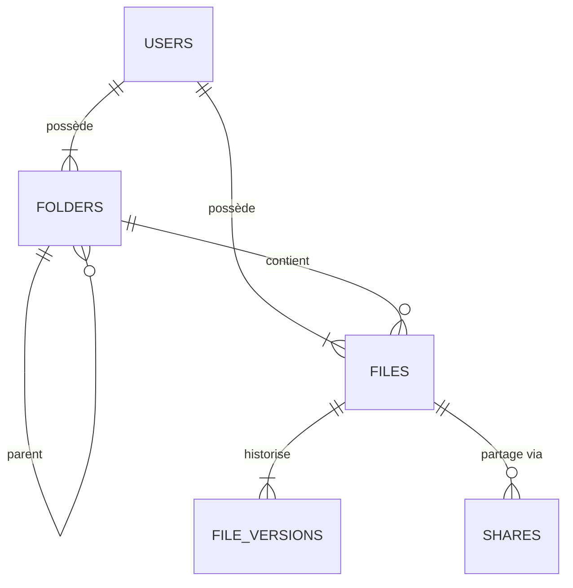

# 🗄️ 02. DOCUMENTATION BASE DE DONNÉES

## 1. Modèle Conceptuel des Données (MCD)
Le schéma est optimisé pour le versioning et le partage stateless.

### Entités et Relations :
- **UTILISATEUR** (id_user, email, password, quota)
- **DOSSIER** (id_folder, nom, status_deleted)
- **FICHIER** (id_file, nom, id_folder)
- **VERSION** (id_version, nom_stockage_chiffre, cle_enveloppe, iv)
- **PARTAGE** (id_share, token, date_expiration, limite_telechargement)

### Schéma Mermaid (Relationnel) :

## 2. Dictionnaire des Données
| Table | Rôle | Sécurité |
| :--- | :--- | :--- |
| **users** | Comptes et Quotas | Password haché en **Bcrypt** |
| **folders** | Arborescence | Soft-delete (drapeau is_deleted) |
| **files** | Métadonnées | Lien logique utilisateur/dossier |
| **file_versions** | Stockage réel | Contient la **Clé Enveloppe** (RSA/AES style) |
| **shares** | Liens publics | Protégé par un **Token Opaque** |

## 3. Choix Technologiques BDD
- **SGBD :** MariaDB (Haute performance, Open Source).
- **Accès :** Medoo ORM (Abstraction PDO, protection native contre les **Injections SQL**).
- **Sécurité :** Les fichiers ne sont jamais identifiables par leur nom réel sur le disque (nom aléatoire en base + extension .enc).
