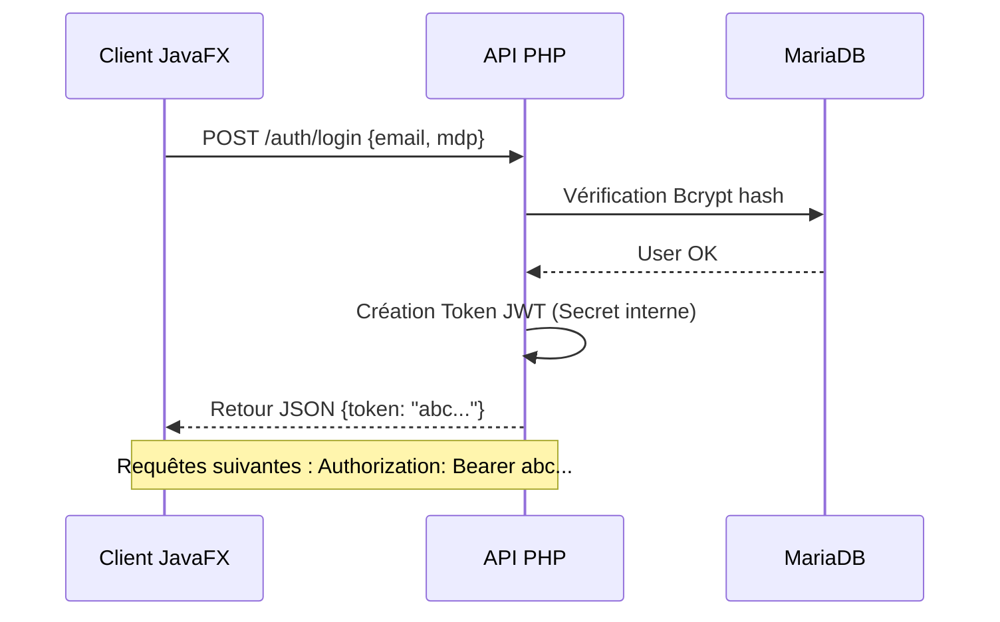

# ⚙️ 03. DOCUMENTATION TECHNIQUE

## 1. Stack Solution
- **Frontend :** JavaFX 17 + CSS (Thème dynamique).
- **Backend :** PHP 8.1 (Slim Framework 4).
- **Cryptographie :** LibSodium (Méthode moderne recommandée).
- **Architecture :** Containers Docker (API + DB).

## 2. Flux d'Authentification (JWT)
Le client ne maintient pas de session serveur (Cookies désactivés).

## 3. Le Chiffrement "Enveloppe"
Le cœur de la sécurité d'ObsiLock.

1.  **Clé de Contenu :** Une clé unique (32 octets) est générée pour CHAQUE fichier.
2.  **Streaming :** Le fichier est chiffré par blocs de **8 KB** (LibSodium SecretBox).
3.  **Enveloppe :** La clé de contenu est chiffrée par une **Clé Maître** (serveur) et stockée en BDD.
4.  **Avantage :** Si la base de données est compromise (volée), les fichiers restent illisibles sans la Clé Maître stockée dans le `.env`.

## 4. Endpoints API
- `POST /auth/login` : Login JWT.
- `POST /files` : Upload streaming chiffré.
- `GET /files/{id}/download` : Déchiffrement à la volée.
- `POST /shares` : Génération lien de partage.
