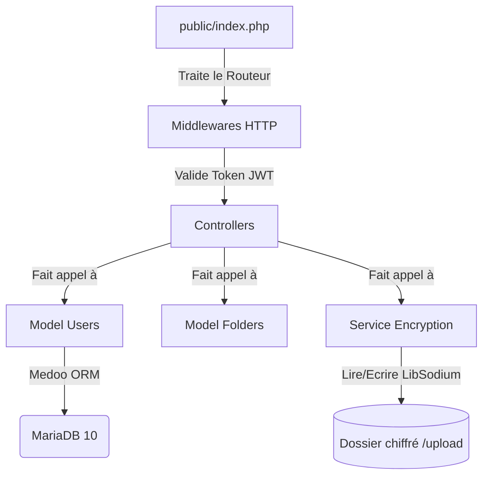
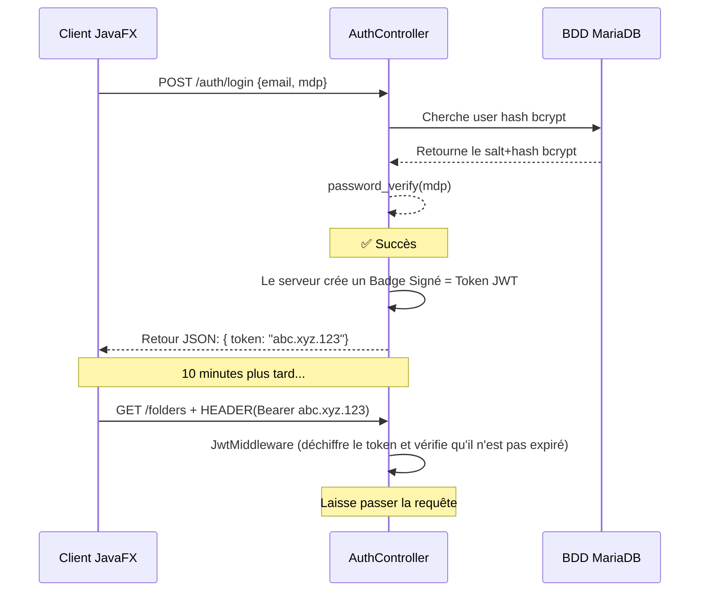
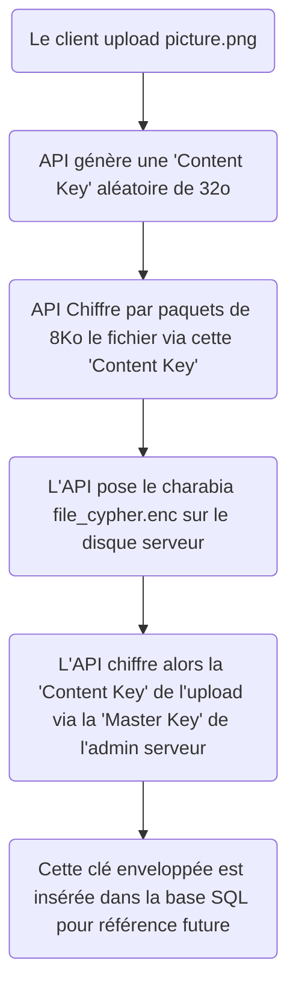

# 3. DOCUMENTATION TECHNIQUE — ObsiLock

*ObsiLock — BTS SIO — 2026*  

---

## 🏗️ 1. Architecture du Backend

Le backend d'ObsiLock est une **API RESTful Stateless**. 
Cela signifie qu'elle ne sauvegarde jamais votre session en mémoire (PHP Session désactivée). La seule façon pour l'API de vous identifier visuellement est de lire un Badge Numérique qui est joint à TOUTES vos requêtes (Header: `Authorization : Bearer token_jwt_abc`).

### Structure MVC (Côté API)

---

## 🔒 2. Le Mécanisme d'Authentification (JWT)

ObsiLock implémente de A à Z le protocole JWT (JSON Web Tokens) crypté en **HS256**. L'avantage de JWT réside l'inutilité de faire une requête à la base de données SQL pour vérifier si l'utilisateur est bien connecté : le calcul mathématique de la clé de hachage du token le valide d'office.

---

## 🔐 3. Le Chiffrement des Fichiers (LIBSODIUM)

Point nodal de la sécurité de cette solution. Les données sont chiffrées selon le principe du **"Chiffrement par Enveloppe Numérique"** (Envelope Encryption), identique à l'architecture que déploient AWS S3 Enterprise ou les gestionnaires très haute sécurité.

1. Application de la surcouche algorithmique **`sodium_crypto_secretbox` (XSalsa20-Poly1305)**
2. Un fichier brut ne reste jamais enregistré de son premier à son dernier octet dans la RAM physique du serveur → Risque de crash serveur *"Out of Memory"* trop grand.
3. Il est streamé (Chiffré puis envoyé vers le disque dur dur en petits morceaux récursifs de 8 Ko).

### L'algorithme du Stream par API

---

## 💻 4. L'API (Endpoints Mapping)

**Les endpoints exposés :** HTTP Verbs strictes. Le format est standardisé en `application/json`.
Format cas d'erreur de retour (ex 422 Unprocessable ou 401 Unauth) : `{ "error" : "Description exacte", "code" : 422 }`

| Méthode | URI | Accès | Description |
| :--- | :--- | :--- | :--- |
| `POST` | `/auth/login` | Public | Création token JWT |
| `POST` | `/files` | Interne JWT | Upload Fichier Streaming |
| `GET` | `/files/{id}` | Interne JWT | Récupère méta FileVersion |
| `GET` | `/files/{id}/download` | Interne JWT | Déchiffre et envoie le Stream HTTP natif |
| `POST` | `/files/{id}/versions` | Interne JWT | Upload une nouvelle modif de ce document |
| `POST` | `/shares` | Interne JWT | Fabrique une route de partage liée au Token aléatoire |
| `GET` | `/s/{token}` | Public | Page "Vue HTML" de consultation sans autorisation |
| `POST` | `/s/{token}/download` | Public | Stream autorisé de dl via le bouton Share (décrémentation d'usure atomique) |

---

## 🐋 5. Deploiement Sécurisé sous Docker

L'état applicatif garantit la ségrégation et le Reverse-Proxy externe.
1. `obsilock-api` = Conteneur custom via `Dockerfile` (Apache, PHP 8). Volumes mappés que sur la route `/uploads`.
2. `obsilock-db` = Service standard Image LTS (MariaDB). Contenu inaccessible depuis l'extérieur, accessible uniquement au conteneur Apache par le port privé interne du LAN Docker. 
3. `traefik` = Moteur Reverse Proxy / Gateway SSL qui écoute au port 80/443 de l'hôte machine `iris` et dirige la route requise à l'intérieur.

> 🔴 **Backup et Reprise Après Sinistre** : Pour qu'un backup de la Database SQL de l'admin + du disque /storage soit parfaitement fonctionnel pour pouvoir relancer l'application après un incendie, **L'ADMINISTRATEUR DOIT CONSERVER PRECIEUSEMENT LA CHAINE DE CHARACTERE "ENCRYPTION_KEY" située dans le paramètre local .env sur un POST-IT PHYSIQUE.** Si la base est restaurée mais le point .env réinitialisé avec un master_key différent : le parc des fichiers est devenu une boite noire aveugle infiniment irrécupérable mathématiquement parlant.
