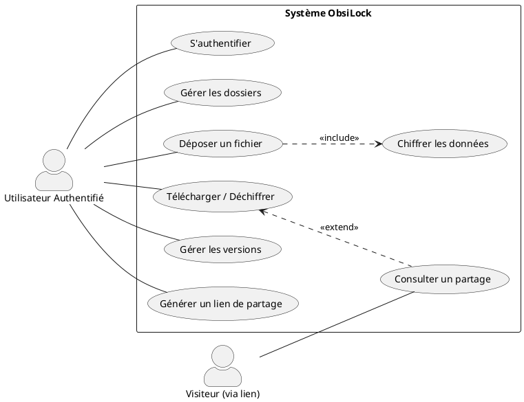

# Diagramme de Cas d'Utilisation - ObsiLock

Le diagramme de cas d'utilisation permet de visualiser les interactions entre les utilisateurs et le système.

## 1. Code PlantUML (À copier-coller)

## 2. Explication des Cas d'Utilisation

### Acteurs :
- **Utilisateur Authentifié** : Possède un compte, gère ses propres données.
- **Visiteur** : Personne externe accédant à un fichier/dossier via un token de partage.

### Cas clés :
- **Déposer un fichier <<include>> Chiffrer** : Le chiffrement LibSodium est obligatoire et transparent lors de l'upload.
- **Consulter un partage <<extend>> Télécharger** : Le visiteur accède à une page de consultation qui lui permet, s'il le souhaite, de déclencher le téléchargement (déchiffrement à la volée).
- **Gérer les versions** : Permet à l'utilisateur de lister et de récupérer d'anciennes versions d'un même fichier (gestion de l'historique).

## 3. Justification pour le dossier
Ce diagramme prouve que le système sépare bien les droits d'administration des données (réservés au propriétaire) et les droits de consultation (ouverts aux tiers via partage sécurisé).
