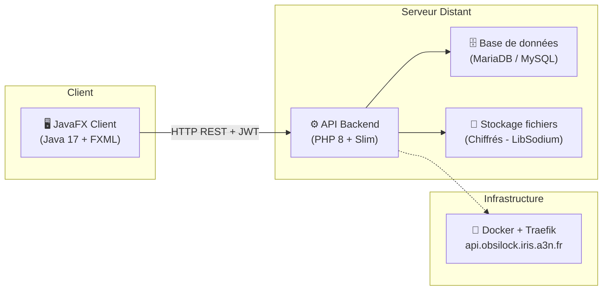
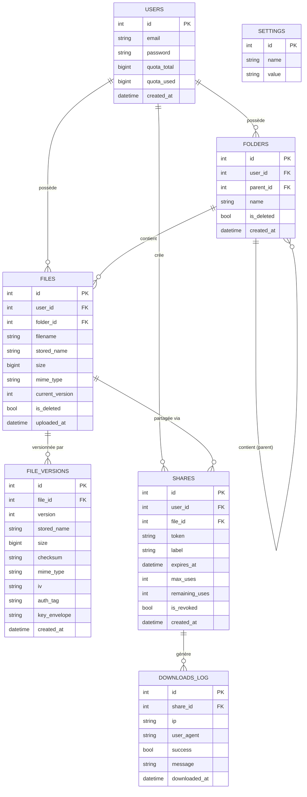
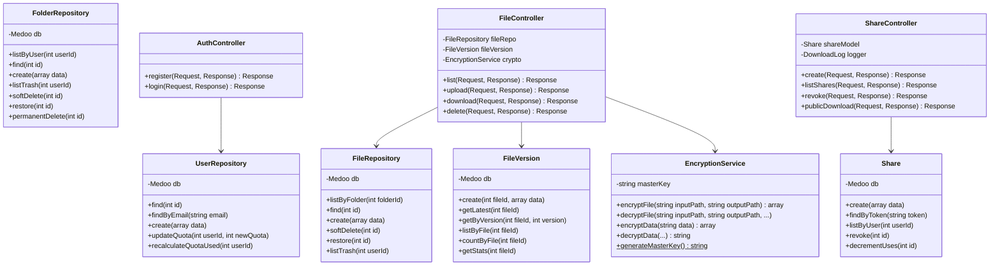
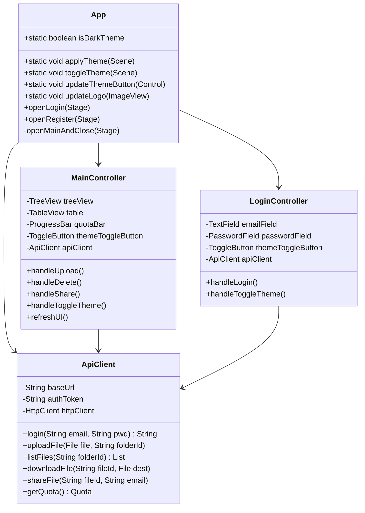
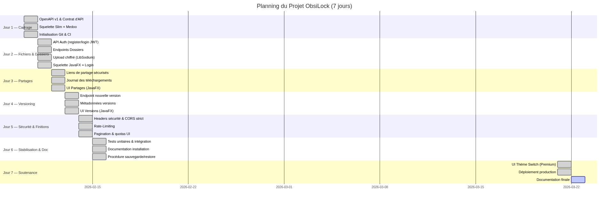

# 📋 Cahier des Charges — ObsiLock : Coffre-Fort Numérique


---

## 1. Contexte du Projet

**ObsiLock** est un système de coffre-fort numérique sécurisé développé dans le cadre du BTS SIO. Il permet à des utilisateurs de stocker, gérer, versionner et partager des fichiers de manière chiffrée, via une architecture **Client/Serveur** découplée.

### 1.1 Problématique
Dans un contexte où les fuites de données et les ransomwares sont en constante augmentation, il devient essentiel de disposer d'une solution de stockage où les fichiers ne sont **jamais stockés en clair** sur le serveur. ObsiLock répond à ce besoin en chiffrant chaque fichier au repos sur le disque du serveur.

### 1.2 Architecture Globale



### 1.3 Stack Technique

| Couche | Technologie | Rôle |
| :--- | :--- | :--- |
| **Frontend** | Java 17 + JavaFX 17 | Interface Desktop (FXML + CSS) |
| **Backend** | PHP 8 + Slim Framework | API REST stateless |
| **ORM** | Medoo (micro-ORM) | Accès BDD simplifié et sécurisé |
| **BDD** | MariaDB 10 / MySQL 8 | Stockage des métadonnées |
| **Crypto** | PHP LibSodium (Chacha20-Poly1305) | Chiffrement des fichiers |
| **Auth** | JWT (JSON Web Tokens) | Authentification stateless |
| **Infra** | Docker + Traefik | Conteneurisation & Reverse Proxy |

---

## 2. Besoins Fonctionnels

### 2.1 Authentification & Gestion des comptes
- Inscription avec email/mot de passe (haché en bcrypt)
- Connexion avec retour d'un JWT signé
- Gestion de session (expiration token, révocation)

### 2.2 Gestion des fichiers & dossiers
- Création/suppression de dossiers (soft delete + corbeille)
- Upload de fichiers chiffré en **streaming** (blocs de 8 Ko)
- Téléchargement avec déchiffrement à la volée
- Renommage de fichiers/dossiers
- Gestion de la corbeille (restauration ou suppression définitive)

### 2.3 Versioning des fichiers
- Chaque upload crée une **version immutable** (`file_versions`)
- La version courante d'un fichier est trackée (`current_version`)
- Historique des versions accessible (date, taille, checksum)

### 2.4 Partages sécurisés
- Création d'un lien de partage par email
- Paramétrage : expiration (date) et/ou nombre max d'utilisations
- Révocation immédiate d'un lien
- Page publique de téléchargement (`/s/{token}`)
- Journal de téléchargement (`downloads_log`)

### 2.5 Gestion des quotas
- Quota par défaut : 50 Mo par utilisateur (configurable)
- Affichage de l'utilisation en temps réel (barre de progression)
- Blocage de l'upload si quota dépassé (HTTP 413)
- Administration des quotas réservée au rôle Admin

### 2.6 Interface & Thématisation
- Interface JavaFX avec thème **Obsidian** (mode sombre) et **Emerald** (vert)
- Interrupteur de thème (Toggle Switch) sur la page de connexion et le dashboard
- Tous les dialogues et pop-ups héritent automatiquement du thème actif

---

## 3. Diagramme MCD (Modèle Conceptuel de Données)



---

## 4. Diagramme MLD (Modèle Logique de Données)

Les clés primaires sont <u>soulignées</u> et les clés étrangères préfixées par `#`.

- **users** (<u>id</u>, email, password, quota_total, quota_used, created_at)
- **folders** (<u>id</u>, #user_id, #parent_id, name, is_deleted, created_at)
- **files** (<u>id</u>, #user_id, #folder_id, filename, stored_name, size, mime_type, current_version, is_deleted, uploaded_at)
- **file_versions** (<u>id</u>, #file_id, version, stored_name, size, checksum, mime_type, iv, auth_tag, key_envelope, created_at)
- **shares** (<u>id</u>, #user_id, #file_id, token, label, expires_at, max_uses, remaining_uses, is_revoked, created_at)
- **downloads_log** (<u>id</u>, #share_id, ip, user_agent, success, message, downloaded_at)
- **settings** (<u>id</u>, name, value)

---

## 5. Diagramme MPD — Script SQL (init.sql réel du projet)

```sql
-- Base : coffre_fort
USE coffre_fort;

CREATE TABLE IF NOT EXISTS users (
    id INT AUTO_INCREMENT PRIMARY KEY,
    email VARCHAR(255) UNIQUE NOT NULL,
    password VARCHAR(255) NOT NULL,
    quota_total BIGINT DEFAULT 52428800,  -- 50 Mo
    quota_used  BIGINT DEFAULT 0,
    created_at  DATETIME DEFAULT CURRENT_TIMESTAMP,
    INDEX idx_email (email)
) ENGINE=InnoDB;

CREATE TABLE IF NOT EXISTS folders (
    id         INT AUTO_INCREMENT PRIMARY KEY,
    user_id    INT NOT NULL,
    parent_id  INT NULL,
    name       VARCHAR(255) NOT NULL,
    is_deleted TINYINT(1) DEFAULT 0,
    created_at DATETIME DEFAULT CURRENT_TIMESTAMP,
    FOREIGN KEY (user_id)   REFERENCES users(id)   ON DELETE CASCADE,
    FOREIGN KEY (parent_id) REFERENCES folders(id) ON DELETE SET NULL,
    INDEX idx_user (user_id)
) ENGINE=InnoDB;

CREATE TABLE IF NOT EXISTS files (
    id              INT AUTO_INCREMENT PRIMARY KEY,
    user_id         INT NOT NULL,
    folder_id       INT NULL,
    filename        VARCHAR(255) NOT NULL,
    stored_name     VARCHAR(255) NOT NULL,
    size            BIGINT NOT NULL,
    mime_type       VARCHAR(100) NOT NULL,
    current_version INT DEFAULT 1,
    is_deleted      TINYINT(1) DEFAULT 0,
    uploaded_at     DATETIME DEFAULT CURRENT_TIMESTAMP,
    FOREIGN KEY (user_id)   REFERENCES users(id)   ON DELETE CASCADE,
    FOREIGN KEY (folder_id) REFERENCES folders(id) ON DELETE SET NULL,
    INDEX idx_user (user_id)
) ENGINE=InnoDB;

CREATE TABLE IF NOT EXISTS file_versions (
    id               INT AUTO_INCREMENT PRIMARY KEY,
    file_id          INT NOT NULL,
    version          INT NOT NULL DEFAULT 1,
    stored_name      VARCHAR(255) NOT NULL,
    size             BIGINT NOT NULL,
    checksum         VARCHAR(64),
    mime_type        VARCHAR(100),
    iv               TEXT,
    auth_tag         TEXT,
    key_envelope     TEXT,
    created_at       DATETIME DEFAULT CURRENT_TIMESTAMP,
    FOREIGN KEY (file_id) REFERENCES files(id) ON DELETE CASCADE,
    UNIQUE KEY unique_version (file_id, version)
) ENGINE=InnoDB;

CREATE TABLE IF NOT EXISTS shares (
    id              INT AUTO_INCREMENT PRIMARY KEY,
    user_id         INT NOT NULL,
    file_id         INT NOT NULL,
    token           VARCHAR(255) UNIQUE NOT NULL,
    label           VARCHAR(255),
    expires_at      DATETIME NULL,
    max_uses        INT NULL,
    remaining_uses  INT NULL,
    is_revoked      TINYINT(1) DEFAULT 0,
    created_at      DATETIME DEFAULT CURRENT_TIMESTAMP,
    FOREIGN KEY (user_id) REFERENCES users(id) ON DELETE CASCADE,
    FOREIGN KEY (file_id) REFERENCES files(id) ON DELETE CASCADE
) ENGINE=InnoDB;

CREATE TABLE IF NOT EXISTS downloads_log (
    id            INT AUTO_INCREMENT PRIMARY KEY,
    share_id      INT NOT NULL,
    ip            VARCHAR(45),
    user_agent    TEXT,
    success       TINYINT(1) DEFAULT 1,
    message       TEXT,
    downloaded_at DATETIME DEFAULT CURRENT_TIMESTAMP,
    FOREIGN KEY (share_id) REFERENCES shares(id) ON DELETE CASCADE
) ENGINE=InnoDB;

CREATE TABLE IF NOT EXISTS settings (
    id    INT AUTO_INCREMENT PRIMARY KEY,
    name  VARCHAR(50) UNIQUE NOT NULL,
    value VARCHAR(255) NOT NULL
) ENGINE=InnoDB;

INSERT INTO settings (name, value) VALUES ('quota_bytes', '52428800')
ON DUPLICATE KEY UPDATE value = '52428800';
```

---

## 6. Diagrammes UML

### 6.1 Diagramme de Cas d'Utilisation

```mermaid
flowchart TD
    User(["👤 Utilisateur"])
    Admin(["🔑 Administrateur"])

    subgraph ObsiLock
        UC1["S'inscrire"]
        UC2["Se connecter (JWT)"]
        UC3["Uploader un fichier (chiffré)"]
        UC4["Télécharger un fichier"]
        UC5["Gérer ses dossiers"]
        UC6["Partager un fichier"]
        UC7["Révoquer un partage"]
        UC8["Voir les versions d'un fichier"]
        UC9["Gérer la corbeille"]
        UC10["Voir son quota"]
        UC11["Changer le thème"]
        UC12["Gérer les quotas utilisateurs"]
        UC13["Voir les logs de téléchargement"]
    end

    User --> UC1
    User --> UC2
    User --> UC3
    User --> UC4
    User --> UC5
    User --> UC6
    User --> UC7
    User --> UC8
    User --> UC9
    User --> UC10
    User --> UC11
    Admin --> UC12
    Admin --> UC13
    Admin --> UC2
```



### 6.2 Diagramme de Classes (Backend PHP)



### 6.3 Diagramme de Classes (Frontend JavaFX)



---

## 7. Planning GANTT (7 jours de développement)



---

## 8. Contraintes & Exigences Non-Fonctionnelles

| Critère | Exigence |
| :--- | :--- |
| **Sécurité** | Aucun fichier stocké en clair. Hachage bcrypt des mots de passe. |
| **Performance** | Chiffrement en streaming (blocs 8 Ko) pour ne pas saturer la RAM. |
| **Disponibilité** | API déployée via Docker sur serveur distant avec Traefik. |
| **Compatibilité** | Java 17+, PHP 8+, MariaDB 10+. |
| **Quota par défaut** | 50 Mo par utilisateur (paramétrable dans `settings`). |
