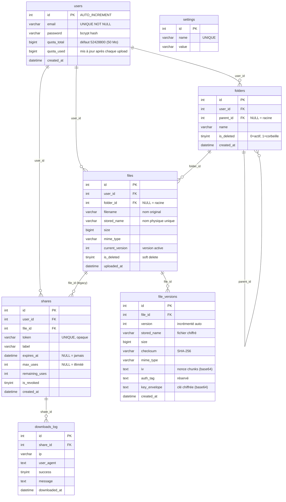

# 🗄️ Documentation Base de Données — ObsiLock

---

## 1. Présentation du Schéma

La base de données `coffre_fort` (MariaDB / MySQL) stocke les **métadonnées** de l'application ObsiLock. Les fichiers eux-mêmes sont stockés chiffrés sur le disque dans `storage/uploads/`, référencés par leurs `stored_name` en base.

### Diagramme des tables

---

## 2. Description Détaillée des Tables

### 2.1 Table `users`

Stocke les informations des utilisateurs inscrits.

| Colonne | Type | Contrainte | Description |
| :--- | :--- | :--- | :--- |
| `id` | INT | PK, AUTO_INCREMENT | Identifiant unique |
| `email` | VARCHAR(255) | UNIQUE NOT NULL | Adresse email (login) |
| `password` | VARCHAR(255) | NOT NULL | Mot de passe hashé (bcrypt) |
| `quota_total` | BIGINT | DEFAULT 52428800 | Espace alloué en octets (50 Mo) |
| `quota_used` | BIGINT | DEFAULT 0 | Espace consommé en octets |
| `created_at` | DATETIME | DEFAULT NOW() | Date de création |

> [!NOTE]
> Le quota par défaut (50 Mo = 52 428 800 octets) est également stocké dans la table `settings` sous la clé `quota_bytes` pour permettre une modification globale sans migration.

---

### 2.2 Table `folders`

Gère l'arborescence de dossiers. Un dossier peut contenir d'autres dossiers via `parent_id` (récursivité).

| Colonne | Type | Contrainte | Description |
| :--- | :--- | :--- | :--- |
| `id` | INT | PK, AUTO_INCREMENT | Identifiant unique |
| `user_id` | INT | FK → users(id) CASCADE | Propriétaire du dossier |
| `parent_id` | INT | FK → folders(id) SET NULL | Dossier parent (NULL = racine) |
| `name` | VARCHAR(255) | NOT NULL | Nom du dossier |
| `is_deleted` | TINYINT(1) | DEFAULT 0 | Soft delete (0=actif, 1=corbeille) |
| `created_at` | DATETIME | DEFAULT NOW() | Date de création |

**Règle de suppression** : La suppression est **logique** (`is_deleted = 1`), préservant l'accès aux fichiers enfants. La suppression physique (`permanentDelete`) efface la ligne et cascade sur les fichiers enfants.

---

### 2.3 Table `files`

Stocke les métadonnées des fichiers. Le fichier physique est référencé par `stored_name`.

| Colonne | Type | Contrainte | Description |
| :--- | :--- | :--- | :--- |
| `id` | INT | PK, AUTO_INCREMENT | Identifiant unique |
| `user_id` | INT | FK → users(id) CASCADE | Propriétaire |
| `folder_id` | INT | FK → folders(id) SET NULL | Dossier parent (NULL = racine) |
| `filename` | VARCHAR(255) | NOT NULL | Nom original du fichier |
| `stored_name` | VARCHAR(255) | NOT NULL | Nom physique unique sur disque |
| `size` | BIGINT | NOT NULL | Taille en octets |
| `mime_type` | VARCHAR(100) | NOT NULL | Type MIME (ex: `application/pdf`) |
| `current_version` | INT | DEFAULT 1 | Numéro de la version active |
| `is_deleted` | TINYINT(1) | DEFAULT 0 | Soft delete |
| `uploaded_at` | DATETIME | DEFAULT NOW() | Date d'upload initial |

---

### 2.4 Table `file_versions`

Chaque upload (initial et remplacement) crée une entrée ici. Les versions sont **immutables**.

| Colonne | Type | Description |
| :--- | :--- | :--- |
| `id` | INT PK | Identifiant unique |
| `file_id` | INT FK | Référence vers `files` |
| `version` | INT | Numéro de version (1, 2, 3...) |
| `stored_name` | VARCHAR(255) | Nom du fichier chiffré sur disque |
| `size` | BIGINT | Taille en octets |
| `checksum` | VARCHAR(64) | SHA-256 du fichier original |
| `mime_type` | VARCHAR(100) | Type MIME |
| `iv` | TEXT | Nonce de début (base64) pour le chiffrement LibSodium par chunks |
| `auth_tag` | TEXT | Réservé (auth tag GCM si utilisé) |
| `key_envelope` | TEXT | Clé de contenu chiffrée avec la clé maître (base64) |
| `created_at` | DATETIME | Date de création de la version |

> [!IMPORTANT]
> La contrainte `UNIQUE(file_id, version)` garantit qu'il n'existe jamais deux versions avec le même numéro pour un même fichier.

---

### 2.5 Table `shares`

Liens de partage sécurisés générés par les utilisateurs.

| Colonne | Type | Description |
| :--- | :--- | :--- |
| `id` | INT PK | Identifiant unique |
| `user_id` | INT FK | Créateur du lien |
| `file_id` | INT FK | Fichier partagé |
| `token` | VARCHAR(255) UNIQUE | Token opaque (aléatoire + HMAC) |
| `label` | VARCHAR(255) | Description du partage |
| `expires_at` | DATETIME NULL | Date d'expiration (NULL = jamais) |
| `max_uses` | INT NULL | Nombre d'usages max (NULL = illimité) |
| `remaining_uses` | INT NULL | Usages restants (décrémenté atomiquement) |
| `is_revoked` | TINYINT(1) | 1 = lien révoqué immédiatement |
| `created_at` | DATETIME | Date de création |

---

### 2.6 Table `downloads_log`

Journal de toutes les tentatives de téléchargement (succès et échecs).

| Colonne | Type | Description |
| :--- | :--- | :--- |
| `id` | INT PK | Identifiant unique |
| `share_id` | INT FK | Lien de partage utilisé |
| `ip` | VARCHAR(45) | Adresse IP du demandeur |
| `user_agent` | TEXT | User-Agent du navigateur/client |
| `success` | TINYINT(1) | 1 = téléchargement réussi |
| `message` | TEXT | Raison de l'échec si applicable |
| `downloaded_at` | DATETIME | Horodatage de la tentative |

---

### 2.7 Table `settings`

Configuration globale de l'application (clé-valeur).

| Clé | Valeur par défaut | Description |
| :--- | :--- | :--- |
| `quota_bytes` | `52428800` | Quota par défaut en octets (50 Mo) |

---

## 3. Index et Performances

| Table | Index | Colonne(s) | Objectif |
| :--- | :--- | :--- | :--- |
| `users` | `idx_email` | `email` | Recherche rapide lors du login |
| `folders` | `idx_user` | `user_id` | Listing des dossiers par utilisateur |
| `files` | `idx_user` | `user_id` | Listing des fichiers par utilisateur |
| `file_versions` | `unique_version` | `(file_id, version)` | Unicité et accès rapide aux versions |
| `shares` | UNIQUE | `token` | Recherche du lien de partage en O(1) |

---

## 4. Script SQL Complet (init.sql)

Voir le fichier [init.sql](file:///home/iris/slam/ObsiLock/init.sql) pour le script de création complet.
