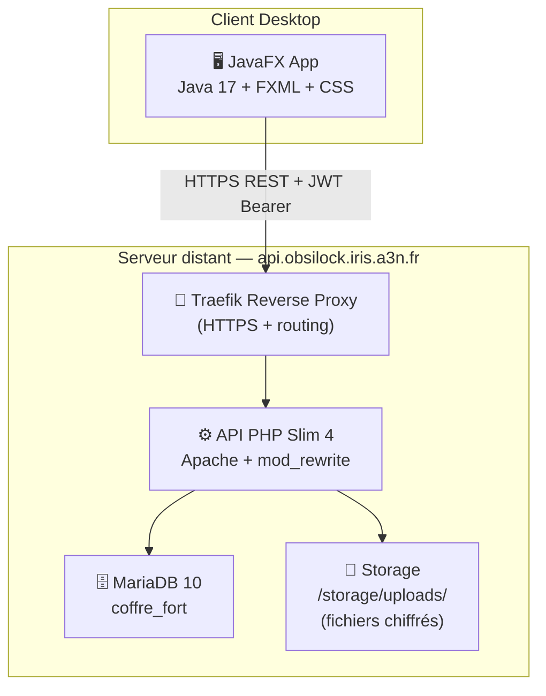
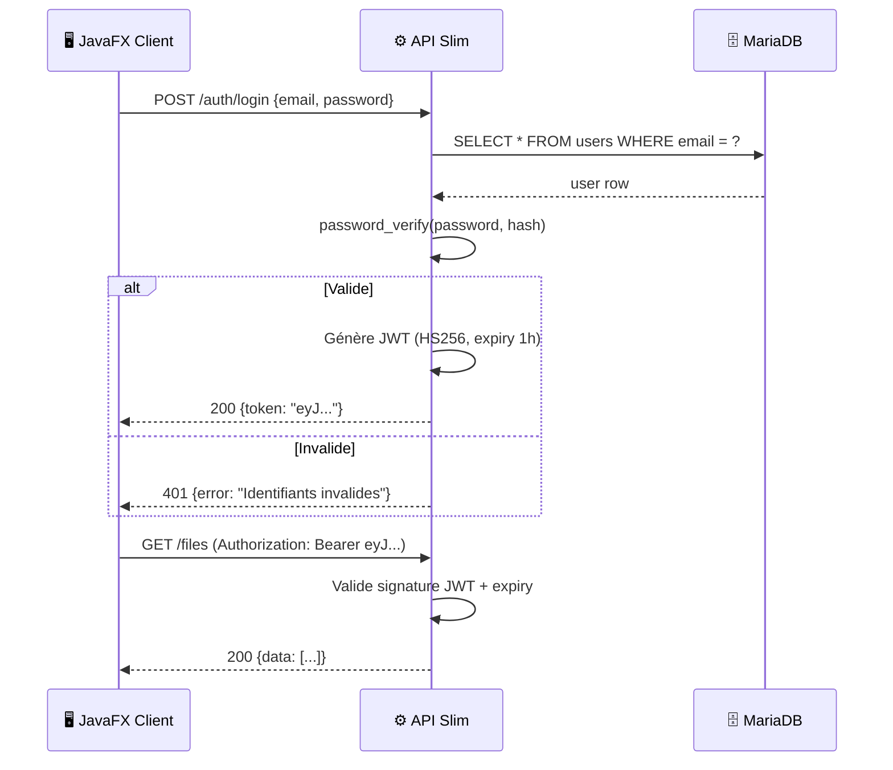
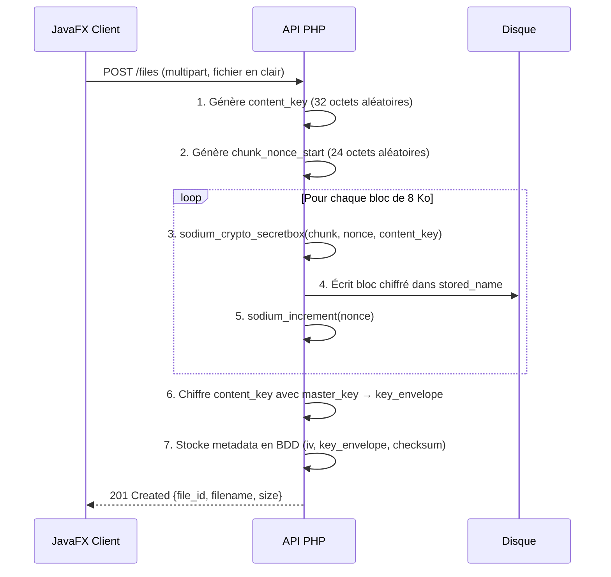

# 💻 Documentation Technique — ObsiLock


---

## 1. Architecture Globale

ObsiLock repose sur une architecture **Client/Serveur découplée et stateless** :



---

## 2. Backend — API PHP Slim 4

### 2.1 Structure des fichiers

```
ObsiLock/
├── public/index.php          ← Point d'entrée unique
├── src/
│   ├── Controller/
│   │   ├── AuthController.php
│   │   ├── FileController.php
│   │   ├── FolderController.php
│   │   └── ShareController.php
│   ├── Middleware/
│   │   ├── RateLimitMiddleware.php
│   │   └── SecurityHeadersMiddleware.php
│   ├── Model/
│   │   ├── UserRepository.php
│   │   ├── FolderRepository.php
│   │   ├── FileRepository.php
│   │   ├── FileVersion.php
│   │   ├── Share.php
│   │   └── DownloadLog.php
│   └── Service/
│       └── EncryptionService.php
├── storage/uploads/           ← Fichiers chiffrés
├── init.sql                   ← Script de création BDD
└── .env                       ← Variables d'environnement
```

### 2.2 Middlewares actifs

| Middleware | Rôle |
| :--- | :--- |
| `SecurityHeadersMiddleware` | Injecte les en-têtes HTTP: `X-Content-Type-Options`, `X-Frame-Options`, `CSP`, `HSTS` |
| `RateLimitMiddleware` | Limite par IP (protection brute-force sur `/auth/login`) |
| JSON Parser (Slim built-in) | Décode le body JSON des requêtes entrantes |
| CORS Middleware | Autorise les origines déclarées (client JavaFX via domaine) |
| JWT Middleware (custom) | Valide le token Bearer sur toutes les routes protégées |

---

## 3. Authentification — JWT

### 3.1 Flux d'authentification



### 3.2 Payload JWT

```json
{
  "user_id": 42,
  "email": "user@example.com",
  "role": "user",
  "iat": 1742654736,
  "exp": 1742658336
}
```

---

## 4. Chiffrement des Fichiers — LibSodium

> [!IMPORTANT]
> C'est le **point fort technique** d'ObsiLock. Aucun fichier n'est jamais stocké en clair sur le disque.

### 4.1 Algorithme

- **Algorithme**: `sodium_crypto_secretbox` (XSalsa20 + Poly1305 MAC)
- **Taille de clé**: 32 octets (256 bits)
- **Taille de nonce**: 24 octets
- **Chiffrement**: Par blocs de **8 192 octets** (streaming, ne charge jamais le fichier entier en RAM)

### 4.2 Processus d'upload chiffré



### 4.3 Processus de téléchargement déchiffré

1. API récupère `key_envelope`, `iv` (chunk_nonce_start) depuis `file_versions`
2. Déchiffre la `key_envelope` avec la `ENCRYPTION_KEY` (master key depuis `.env`)
3. Lit le fichier chiffré bloc par bloc (8 Ko + 16 octets MAC)
4. Déchiffre chaque bloc et l'envoie directement dans la réponse HTTP (streaming)

### 4.4 Variables d'environnement liées

```bash
ENCRYPTION_KEY=<clé base64 de 32 octets>  # Générée par EncryptionService::generateMasterKey()
JWT_SECRET=<secret pour signature JWT>
```

---

## 5. Référence des Endpoints API

### 5.1 Authentification

| Méthode | Route | Auth | Description | Corps attendu |
| :--- | :--- | :---: | :--- | :--- |
| POST | `/auth/register` | ❌ | Inscription | `{email, password}` |
| POST | `/auth/login` | ❌ | Connexion → retourne JWT | `{email, password}` |

### 5.2 Dossiers

| Méthode | Route | Auth | Description |
| :--- | :--- | :---: | :--- |
| GET | `/folders` | ✅ | Liste les dossiers (racine ou par `parent_id`) |
| POST | `/folders` | ✅ | Crée un dossier `{name, parent_id?}` |
| DELETE | `/folders/{id}` | ✅ | Soft-delete (corbeille) |
| POST | `/folders/{id}/restore` | ✅ | Restaure depuis la corbeille |
| DELETE | `/folders/{id}/permanent` | ✅ | Suppression définitive |

### 5.3 Fichiers

| Méthode | Route | Auth | Description |
| :--- | :--- | :---: | :--- |
| GET | `/files` | ✅ | Liste les fichiers d'un dossier (`?folder_id=`) |
| POST | `/files` | ✅ | Upload (multipart/form-data), chiffre et stocke |
| GET | `/files/{id}` | ✅ | Métadonnées + historique versions |
| GET | `/files/{id}/download` | ✅ | Téléchargement déchiffré |
| DELETE | `/files/{id}` | ✅ | Soft-delete |
| POST | `/files/{id}/versions` | ✅ | Upload nouvelle version |
| GET | `/files/{id}/versions` | ✅ | Liste les versions |

### 5.4 Partages

| Méthode | Route | Auth | Description |
| :--- | :--- | :---: | :--- |
| POST | `/shares` | ✅ | Crée un lien `{file_id, label?, expires_at?, max_uses?}` |
| GET | `/shares` | ✅ | Liste les partages de l'utilisateur |
| POST | `/shares/{id}/revoke` | ✅ | Révocation immédiate |
| GET | `/s/{token}` | ❌ | Métadonnées publiques du partage |
| POST | `/s/{token}/download` | ❌ | Téléchargement public + journalisation |

### 5.5 Quotas

| Méthode | Route | Auth | Description |
| :--- | :--- | :---: | :--- |
| GET | `/me/quota` | ✅ | Retourne `{used, total, percent}` |
| PUT | `/admin/users/{id}/quota` | ✅ Admin | Modifie le quota d'un utilisateur |

### 5.6 Format des erreurs

Toutes les erreurs respectent le format :
```json
{
  "error": "Message lisible",
  "code": "CODE_ERREUR"
}
```

| Code HTTP | Signification |
| :--- | :--- |
| 400 | Requête malformée |
| 401 | Non authentifié (token manquant ou expiré) |
| 403 | Accès interdit (ressource d'un autre user) |
| 404 | Ressource introuvable |
| 409 | Conflit (ex: dossier non vide) |
| 413 | Quota dépassé |
| 422 | Erreur de validation (champ manquant) |
| 429 | Trop de requêtes (rate-limit) |

---

## 6. Infrastructure — Docker & Déploiement

### 6.1 Conteneurs Docker Compose

```yaml
# docker-compose.yml (simplifié)
services:
  db:
    image: mariadb:10
    environment:
      MYSQL_DATABASE: coffre_fort
      MYSQL_ROOT_PASSWORD: ${DB_PASS}
    volumes:
      - ./init.sql:/docker-entrypoint-initdb.d/init.sql

  api:
    build: .
    environment:
      DB_DSN: mysql:host=db;dbname=coffre_fort
      ENCRYPTION_KEY: ${ENCRYPTION_KEY}
      JWT_SECRET: ${JWT_SECRET}
    volumes:
      - ./storage:/var/www/html/storage
    labels:
      - "traefik.enable=true"
      - "traefik.http.routers.api.rule=Host(`api.obsilock.iris.a3n.fr`)"

  phpmyadmin:
    image: phpmyadmin
    ports:
      - "8081:80"
```

### 6.2 Dockerfile (résumé)

- Base: `php:8-apache`
- Extensions installées: `pdo_mysql`, `sodium`, `mbstring`
- Module Apache: `mod_rewrite` (pour le routage Slim)
- `DOCUMENT_ROOT` → `public/`

---

## 7. Client JavaFX

### 7.1 Architecture du client

- **Pattern MVC** : Contrôleurs (`*Controller.java`) séparés des vues (`.fxml`) et du modèle (`model/`)
- **ApiClient.java** : Singleton gérant toutes les requêtes HTTP REST (via `java.net.http.HttpClient`)
- **SessionManager** : Surveille l'expiration de la session JWT et redirige vers le login
- **App.java** : Gère le cycle de vie du thème CSS (dark/light) appliqué à toutes les scènes

### 7.2 Système de thème

```java
// App.java
public static void applyTheme(Scene scene) {
    scene.getStylesheets().clear();
    String css = isDarkTheme ? DARK_THEME : LIGHT_THEME;
    scene.getStylesheets().add(App.class.getResource(css).toExternalForm());
}
```

Thèmes disponibles :
- `style-javafx.css` → Mode Obsidian (sombre, accent vert `#94E01E`)
- `style-light.css` → Mode Emerald Green (fond clair, vert `#1e8449`)

---

## 8. Sauvegarde & Restauration

### 8.1 Sauvegarde (via `backup.sh`)

```bash
# Dump BDD
mysqldump -u root -p coffre_fort > backup_$(date +%Y%m%d).sql

# Archive des fichiers chiffrés
tar -czf storage_$(date +%Y%m%d).tar.gz storage/uploads/
```

### 8.2 Restauration (via `restore.sh`)

```bash
mysql -u root -p coffre_fort < backup_YYYYMMDD.sql
tar -xzf storage_YYYYMMDD.tar.gz -C /var/www/html/
```

> [!WARNING]
> La restauration des fichiers sans la `ENCRYPTION_KEY` d'origine rend les fichiers **inaccessibles** (mais ne les corrompent pas). Conserver la clé dans un gestionnaire de secrets sécurisé.
