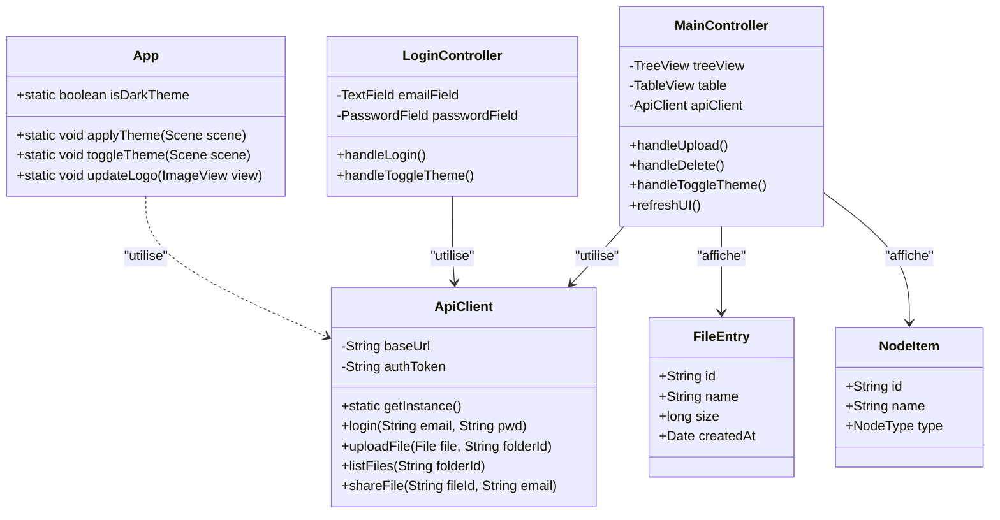

# Diagrammes UML - ObsiLock

## 1. Diagramme de Cas d'Utilisation (Use Case)

Le diagramme montre les interactions entre les différents acteurs (Utilisateurs et Admin) et le système.

```mermaid
usecaseDiagram
    actor "Utilisateur Lambda" as user
    actor "Administrateur" as admin

    rectangle "ObsiLock System" {
        user -- (Inscription / Connexion)
        user -- (Uploader / Télécharger)
        user -- (Gérer ses dossiers / fichiers)
        user -- (Partager un fichier)
        user -- (Gérer la corbeille)
        user -- (Switch de Thème)

        admin -- (Inscription / Connexion)
        admin -- (Gérer tous les utilisateurs)
        admin -- (Modifier les quotas globaux)
        admin -- (Purger la corbeille système)
    }
```

## 2. Diagramme de Classes (Class Diagram - Frontend)

Représente l'architecture logicielle JavaFX et les couches de données.


